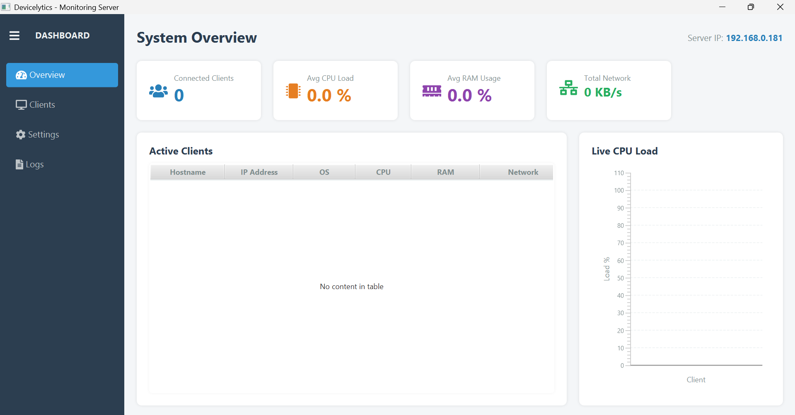
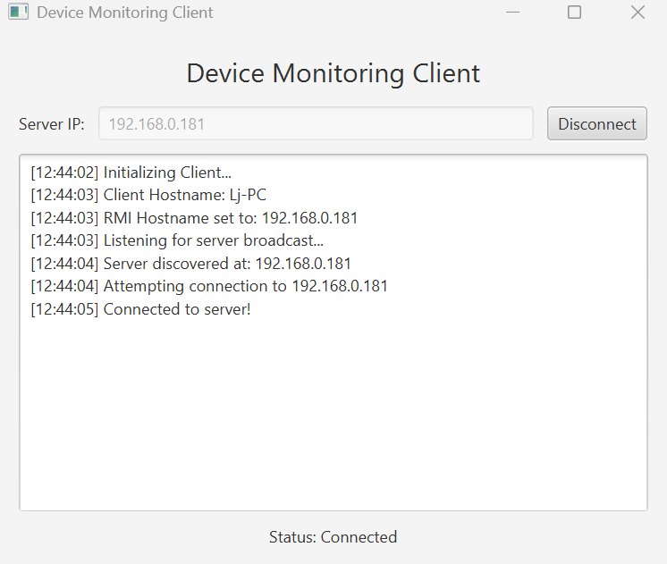
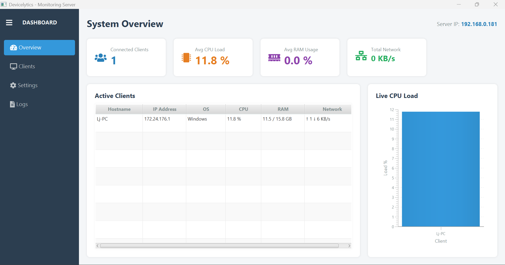
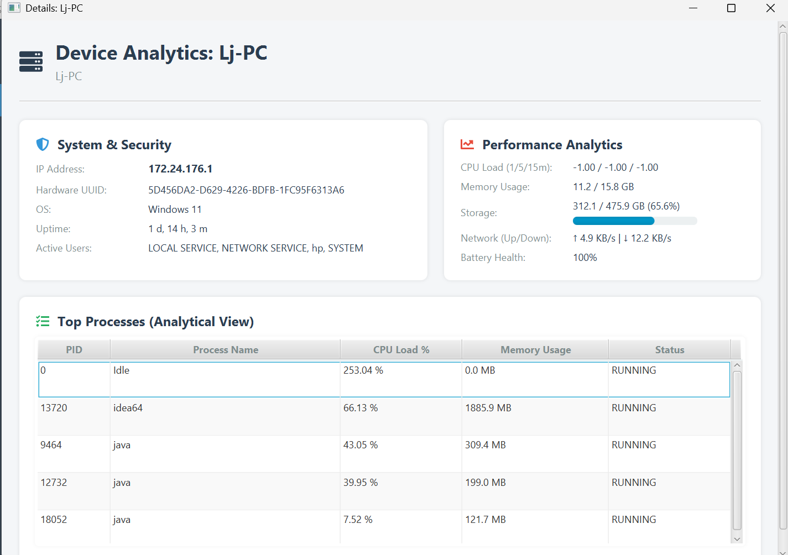
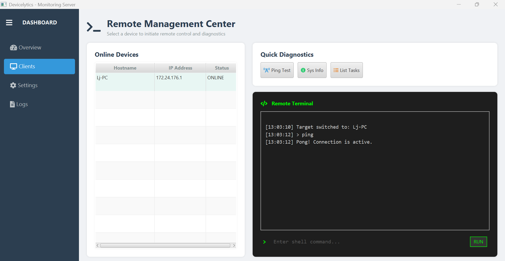

# Devicelytics: System Monitoring & Analytics

**Devicelytics** is a robust, distributed system monitoring solution designed to provide real-time analytical insights into a fleet of devices. It consists of a lightweight Client agent and a centralized JavaFX-based Server Dashboard.

## 🚀 Key Features

### 📊 Real-time Analytical Dashboard

- **Performance Tracking**: Monitor CPU load averages (1/5/15m), RAM usage, and network throughput across all connected devices.
- **Hardware Insights**: Detailed views for CPU models, thermal sensors, storage health, and battery status.
- **Process Monitoring**: Track the top 5 resource-intensive processes on every machine.

### 🛡️ Security & Compliance

- **Active User Tracking**: See who is currently logged into any device in your network.
- **Unique Identification**: Persistent tracking of devices using BIOS/Hardware UUIDs, regardless of IP changes.
- **Network Visibility**: Identify connection types (Wi-Fi vs. Ethernet) and MAC addresses.

### 🎮 Remote Management (Command Center)

- **Terminal Access**: Execute secure shell commands directly on remote clients (Windows CMD / Linux Bash).
- **Quick Diagnostics**: One-click "Ping Tests" and "System Info" reports.
- **Live Console**: Monospaced terminal UI with auto-scrolling and timestamped command history.

## 🛠️ Technology Stack

- **Java 11/17**: Core language for both Client and Server.
- **OSHI (Operating System and Hardware Information)**: High-performance library for native metric collection.
- **Java RMI (Remote Method Invocation)**: Efficient, low-latency communication protocol between agents and the server.
- **JavaFX**: Modern, responsive desktop UI for the administrative dashboard.
- **Ikonli**: Font-awesome integration for a professional look and feel.

## 📁 Project Structure

- `ImonitorClient`: Lightweight agent that runs on target machines.
- `ImonitorServer`: Centralized hub that collects data and provides the management UI.
- `common`: Shared RMI interfaces and data models (DeviceStatus, GPUInfo, etc.).

## 📖 How to Run

### Server

1. Run `ServerApp.java`.
2. The server will start an RMI registry on port `1099` and begin broadcasting its presence on the local network (port `8888`).

### Client

1. Run `MonitorClientImpl.java`.
2. The client will automatically discover the server on the network (or you can provide the IP as an argument).
3. If the server goes down, the client will gracefully log a retry message and attempt to reconnect every 10 seconds.

## 📸 Screenshots

Here are some screenshots showcasing the key features of Devicelytics in action:

### 1. Server Dashboard Overview

This screenshot displays the main server dashboard, showing a list of connected devices with their current status, IP addresses, and basic metrics like CPU and RAM usage. It provides a high-level view of the entire monitored network.

### 2. Device Performance Details

A detailed view of a specific device's performance metrics, including CPU load averages, RAM usage, network throughput, and hardware information such as CPU model and thermal sensors. This helps administrators identify potential bottlenecks.

### 3. Process Monitoring

This image shows the process monitoring feature, listing the top 5 resource-intensive processes running on a selected device. It includes process names, IDs, CPU usage, and memory consumption for quick identification of performance issues.

### 4. Remote Terminal Access

Demonstrating the remote management capabilities, this screenshot shows the terminal interface where administrators can execute commands directly on remote clients. The live console supports both Windows CMD and Linux Bash with timestamped command history.

### 5. User Tracking and Network Info

This view highlights security features, displaying active user sessions on devices, unique hardware UUIDs for identification, and network details including connection types (Wi-Fi/Ethernet) and MAC addresses.

---

_Developed for Proactive System Maintenance and Analytical Oversight._
